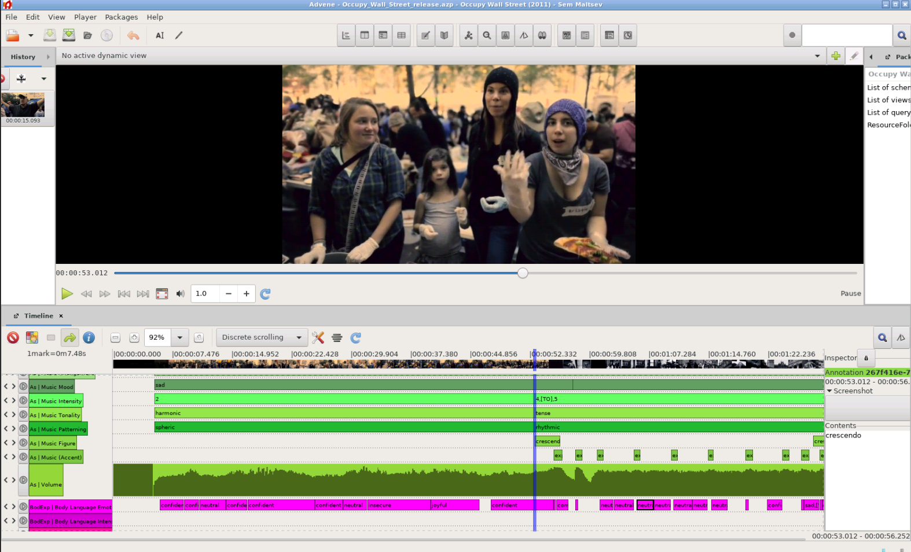
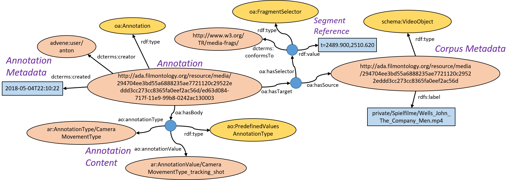
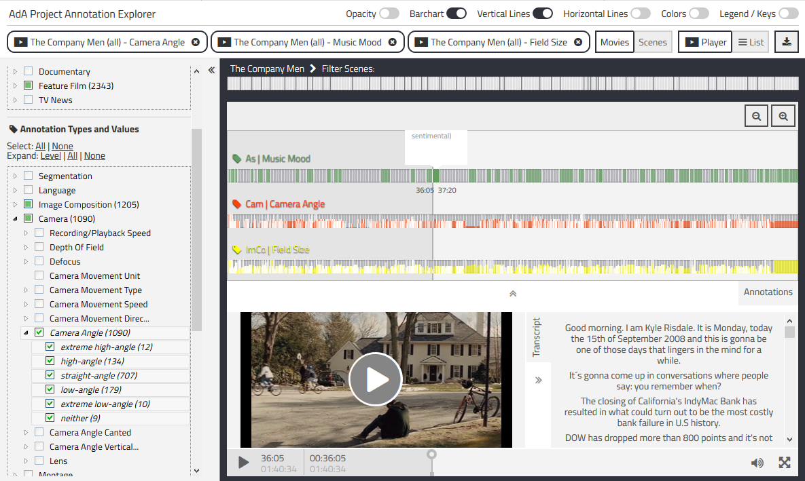

## Film-Analytical Annotations

*Image Credit: Screenshot of Advene annotation software showing the Occupy Wall Street video.*

Throughout the project, the FU Berlin project team created a very high quality data set of manual film-analytical annotations for a set of feature films, documentaries, and television news. These valuable annotations are published here as Linked Open Data under the CC BY-SA 3.0 license to make the data available to other film scientists as well as researchers from other domains.

### Annotation Creation

The annotations were created based on a film scholar's analytical framework ([eMAEX method](https://www.ada.cinepoetics.fu-berlin.de/en/Methoden/eMAEX/index.html)) to study the aesthetics of audio-visual images. The annotation work followed a strict annotation routine to precisely describe the films of the [corpus](../corpus) under different levels of description (see [ontology](../ontology)).

The annotation process is carried out with [Advene](https://www.advene.org/), a free software toolkit for annotating audio-visual documents. We worked closely with Olivier Aubert, one of the authors of Advene, on the one hand to improve the user interface for faster annotation work, and on the other hand to enable the import of the AdA filmontology and the export of W3C compliant video annotations as RDF data.

To create annotations that conform to the AdA filmontology, you can use the [Advene template package](https://github.com/ProjectAdA/public/tree/master/advene_template) that we provide in our GitHub repository.

### Structure

The datasets created in the AdA project consist of thousands of annotations that use timecode-based references to the original video material. Each annotation refers to a fragment of a movie using start and end timecodes to which the annotation applies. The actual content of the annotation refers to the film-analytical concept described by the annotator as defined by the annotation types and values in the AdA filmontology. Each annotation also contains metadata about the author and the creation date.

For example, the following information is available to characterize camera movement in minute 41 of the feature film "The Company Men":

| Annotation ID | [ed63d084-717f-11e9-99b8-0242ac130003](http://ada.filmontology.org/resource/media/294704ee3bd55a6888235ae7721120c29522eddd3cc273cc8365fa0eef2ac56d/ed63d084-717f-11e9-99b8-0242ac130003) |
| Begin timecode | 00:41:29.900 | 
| End  timecode | 00:41:50.620 | 
| Annotation Type | [Camera Movement Type](http://ada.filmontology.org/resource/2020/03/17/AnnotationType/CameraMovementType)|
| Annotation Value | [tracking shot](http://ada.filmontology.org/resource/2020/03/17/AnnotationValue/CameraMovementType_tracking_shot)|
| Author | anton |
| Date | 2018-05-04 22:10:22 |

### Encoding

Our annotations are encoded using the latest [W3C Web Annotation Data Model](https://www.w3.org/TR/annotation-model/). An annotation in this model is a relationship between resources, which normally consists of a body (the description) and a target (an external resource, e.g., a movie, an MP3 file, a PDF document). Since we have to refer to parts of external resources (video fragments), we use the standard [W3C Media Fragments URI](https://www.w3.org/TR/media-frags/) to encode temporal references in URIs. Using the example above, the annotation type and value are encoded in the annotation body and the video segment is referenced with the timecode interval *t=2489.900,2510.620*. 

*Image: A semantic video annotation as RDF graph.*

### Online Access

All annotations are published online in our triplestore. The annotations can be accessed through their URIs. Here are some examples:

| The Company Men | Annotation with one predefined value | Timecode 00:41:29-00:41:50 | [Camera Movement Type: tracking shot](http://ada.filmontology.org/resource/media/294704ee3bd55a6888235ae7721120c29522eddd3cc273cc8365fa0eef2ac56d/ed63d084-717f-11e9-99b8-0242ac130003) |
| The Company Men | Annotation with evolving values | Timecode 00:41:29-00:41:50 | [Camera Angle Canted: level [TO] tilt right](http://ada.filmontology.org/resource/media/294704ee3bd55a6888235ae7721120c29522eddd3cc273cc8365fa0eef2ac56d/ed63f0be-717f-11e9-99b8-0242ac130003) |
| Inside Job | Annotation with a text value | Timecode 00:01:05-00:01:13 | [Dialogue transcript](http://ada.filmontology.org/resource/media/1efe8238d70064653f065750f9b92e89505fcb16fa8bd5cf4b8c95b82dcc905c/1c73f962-7180-11e9-9cd5-0242ac130003) |

We also developed the [Annotation Explorer](http://ada.filmontology.org/explorer/). It's a web-based application for querying, analyzing and visualizing semantic video annotations that provides access to over 90,000 annotations in a consistent way. It is also possible to query the raw RDF data using our public [SPARQL endpoint](http://ada.filmontology.org/sparql).

*Image: Screenshot of our Annotation Explorer web app with queries of annotations from the film "The Company Men".*

### Download

All annotation datasets are available for download in our [GitHub repository](https://github.com/ProjectAdA/public/tree/master/annotations) as RDF export in Turtle format and in JSON-LD format. Currently, we provide annotations for the following movies:

| Movie | # Annotations |
|-------|---------------|
| Capitalism: A Love Story | 19917 |
| Inside Job | 14422 |
| Margin Call | 546 |
| Occupy Wall Street | 581 |
| Tagesschau 2008-07-15 | 442 |
| Tagesschau 2008-09-08 | 345 |
| Tagesschau 2008-09-12 | 495 |
| Tagesschau 2008-09-13 | 414 |
| Tagesschau 2008-09-15 | 565 |
| Tagesschau 2008-09-16 | 829 |
| Tagesschau 2008-09-17 | 532 |
| Tagesschau 2008-09-18 | 487 |
| Tagesschau 2008-09-19 | 805 |
| Tagesschau 2008-09-20 | 314 |
| Tagesschau 2008-09-21 | 512 |
| Tagesschau 2008-09-22 | 534 |
| Tagesschau 2008-09-23 | 520 |
| Tagesschau 2008-09-24 | 415 |
| Tagesschau 2008-09-25 | 608 |
| Tagesschau 2008-09-26 | 470 |
| Tagesschau 2008-09-29 | 439 |
| Tagesschau 2008-09-30 | 684 |
| The Big Short | 22892 |
| The Company Men | 24285 |
| **Total** | **92053** |

[comment]: <> (Scene Segmentation)

[comment]: <> (Annotation  Querys / SPARQL)
