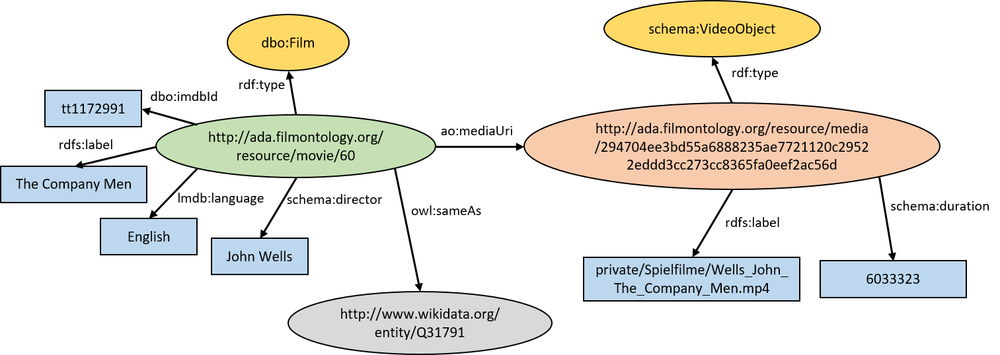

## Corpus Metadata

*Image Credits: External content by IMDb/Amazon*

The FU Berlin project team compiled a video corpus with feature films, documentaries, television news and web videos on the global financial crisis after 2007 in order to investigate audio-visual rhetorics of affect. Since the films cannot be published for copyright reasons, we offer the semantic metadata of the corpus here.

### Structure and Content

The corpus metadata is divided into general film metadata and metadata for video files. Film metadata contains information such as the identifier, title, director and summary of the film. The file metadata contains the exact runtime, the file name and an identifier that was determined by the SHA256 checksum of the file. 

The corpus currently contains 404 movies (13 feature films, 76 documentaries, 315 TV news shows). 390 movies are available as transcoded material for analysis.

For example, the metadata for the feature film "The Company Men" is available as follows:

| Identifer | 60 |
| Title | The Company Men |
| Year | 2010 |
| Language | English |
| Writer | John Wells |
| Director | John Wells |
| Runtime | 104 min |
| Abstract | The story centers on a year in the life of three men trying to survive a round of corporate downsizing at a major company - and how that affects them, their families, and their communities. |
| Actors | Ben Affleck, Tommy Lee Jones, Chris Cooper, Suzanne Rico |
| IMDB | http://www.imdb.com/title/tt1172991 |
| Release&nbsp;date | 11.02.2011 |
| Genre | Feature Film |

The file metadata for the feature film "The Company Men" is available as follows:

| Identifer | 294704ee3bd55a6888235ae7721120c29522eddd3cc273cc8365fa0eef2ac56d |
| Filename | Wells_John_The_Company_Men.mp4 |
| Duration | 6033323 ms|

### Encoding

The corpus metadata is encoded as RDF data using existing vocabularies such as the [DBpedia Ontology](https://wiki.dbpedia.org/services-resources/ontology), [Schema.org](https://schema.org/), and the [Linked Movie DataBase](http://linkedmdb.org/). Where appropriate, our resources have been linked to Wikidata and DBpedia entities.

### Online Access

As for the [ontology](../ontology), metadata for the corpus can be viewed online in our triplestore. The [Corpus](http://ada.filmontology.org/resource/Corpus) resource can be used as an entry point. More examples are listed below:

|Feature Film|The Company Men|[Movie URI](http://ada.filmontology.org/resource/movie/60)|[Media URI](http://ada.filmontology.org/resource/media/294704ee3bd55a6888235ae7721120c29522eddd3cc273cc8365fa0eef2ac56d)|
|Documentary|Occupy Wall Street|[Movie URI](http://ada.filmontology.org/resource/movie/74)|[Media URI](http://ada.filmontology.org/resource/media/39953b6ccea8c49b0a119f1715aab20818e4564cc4b2c2e8567722c9f418f1b9)|
|TV News|Tagesschau 2008-09-08|[Movie URI](http://ada.filmontology.org/resource/movie/135)|[Media URI](http://ada.filmontology.org/resource/media/acf1fece68a0a33b2d5acc6a68c2affd4913296935bf37a21e0444aa386e2f7b)|

We also developed a [Corpus Overview Web Application](http://ada.filmontology.org/corpus/) to access the corpus metadata and to download annotation templates for the Advene annotation software.

### Download

The corpus metadata is also available for download in our [GitHub repository](https://github.com/ProjectAdA/public/tree/master/ontology) as RDF export in Turtle format.

