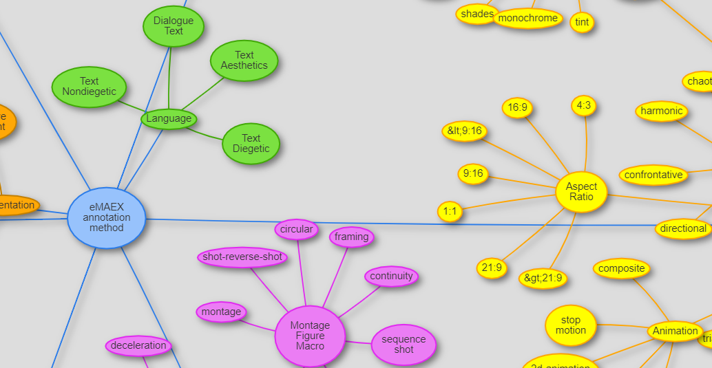
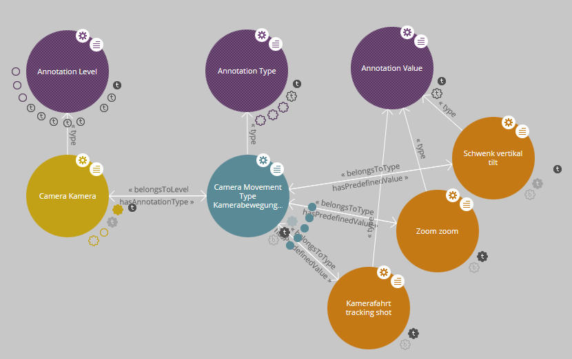
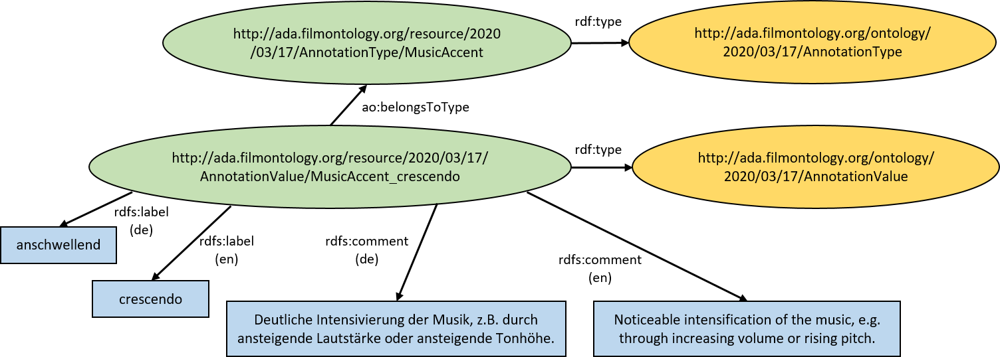

## The AdA Filmontology

*Image Credit: Screenshot of our ontology visualization tool.*

The AdA filmontology is a systematic vocabulary and data model of film-analytical terms and concepts for fine-grained semantic video annotations.

### Purpose

The vocabulary is developed in close collaboration between film scholars and computer scientists to support digital film studies. Its goal is to provide a standardized and systematic way for the joint annotation of audio-visual corpora to enable comparable, systematic film analyzes. The vocabulary is grounded in a methodological film-analytical consensus and is made available as a machine-readable OWL ontology to publish annotations as Linked Open Data for the exchange and comparison of analysis data.

### Structure

The AdA filmontology is structured into three different kinds of film-analytical concepts:

| Annotation Levels | General categories of description (e.g., acoustics, camera) |
| Annotation Types | Concepts of film analysis under which a movie is analyzed (e.g., music mood, camera movement speed) |
| Annotation Values | A set of predefined values assigned to each annotation type (e.g., neutral, tense, happy, sad, aggressive for music mood) |

*Image: The structure of levels, types, and values visualized using LodLive.*

The ontology allows free text annotations (around a quarter of the types, e.g., dialog text) and annotations with predefined values (around three quarters of the types, see above).

### Content

The AdA filmontology v1.8 currently consists of 8 annotation levels, 78 annotation types and 501 annotation values. Each level, type and value has a unique resource identifier (URI), an English and German name, and an English and German description. In addition, types are assigned color codes for better differentiation in annotation software tools.

For example, the predefined value *crescendo* of the annotation type *MusicAccent* is defined as follows.

| URI | [http://ada.filmontology.org/resource/2020/03/17/AnnotationValue/MusicAccent_crescendo](http://ada.filmontology.org/resource/2020/03/17/AnnotationValue/MusicAccent_crescendo) |
| Label (de) | anschwellend | 
| Label (en) | crescendo | 
| Description (de) | Deutliche Intensivierung der Musik, z.B. durch ansteigende Lautstärke oder ansteigende Tonhöhe. | 
| Description (en) | Noticeable intensification of the music, e.g. through increasing volume or rising pitch. | 
| Belongs to Type | [MusicAccent](http://ada.filmontology.org/resource/2020/03/17/AnnotationType/MusicAccent) | 

### Encoding

The AdA filmontology is encoded as OWL ontology using the Resource Description Framework (RDF) and RDF schema. RDF is a graph data model, statements are formulated as in the form of *subject*, *predicate*, *object* (RDF
triples).

*Image: Definition of an annotation value as RDF graph.*

### Online Access

We provide a browsable online version of the AdA filmontology. Each entry of the ontology can be accessed by retrieving the respective URI of the term. The [eMAEX annotation method](http://ada.filmontology.org/resource/2020/03/17/eMAEXannotationMethod) resource can be used as an entry point. More examples are listed below:

| Annotation Level | [Camera](http://ada.filmontology.org/resource/2020/03/17/AnnotationLevel/Camera)|
| Annotation Level | [Acoustics](http://ada.filmontology.org/resource/2020/03/17/AnnotationLevel/Acoustics)|
| Annotation Type | [Camera Movement Type](http://ada.filmontology.org/resource/2020/03/17/AnnotationType/CameraMovementType)|
| Annotation Type | [Music Mood](http://ada.filmontology.org/resource/2020/03/17/AnnotationType/MusicMood)|
| Annotation Value | [Camera Movement Type - tracking shot](http://ada.filmontology.org/resource/2020/03/17/AnnotationValue/CameraMovementType_tracking_shot)|
| Annotation Value | [Music Mood - sad](http://ada.filmontology.org/resource/2020/03/17/AnnotationValue/MusicMood_sad)|

The data is served using the RDF triplestore [OpenLink Virtuoso](https://virtuoso.openlinksw.com/) and [LodView](https://github.com/LodLive/LodView), a software for W3C standard compliant IRI dereferenciation.

We also developed an interactive visualization of the AdA filmontology that can be accessed in our [OntoViz tool](http://ada.filmontology.org/ontoviz/).

### Download

The AdA filmontology is available for download in our [GitHub repository](https://github.com/ProjectAdA/public/tree/master/ontology). The OWL file can, for example, be viewed and edited with the [Protégé ontology editor](https://protege.stanford.edu/). We also offer a ready-to-use [Advene template package](https://github.com/ProjectAdA/public/tree/master/advene_template) to create annotations that conform to AdA filmontology.

[comment]: <> (Data model - types etc.)

