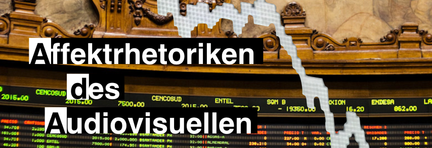

## Publications

*Image Credit: Isaias Campbell, CC–BY–SA 3.0*

The research work within the project resulted in the following publications:

**AdA Filmontology – a machine-readable Film Analysis Vocabulary for Video Annotation**. Jan-Hendrik Bakels, Thomas Scherer, Jasper Stratil, Henning Agt-Rickauer. [Digital Humanities Conference 2020](https://dh2020.adho.org/) (DH2020). Ottawa, Canada, July 22-24, 2020. [[pdf]](dh2020.pdf)

**Standardization and Automation of Audiovisual Annotations**. Henning Agt-Rickauer, Christian Hentschel. Panel "Between Data Mining and Human Experience – Digital Approaches to Film, Television and Video Game Analysis". [Digital Humanities Conference 2019](https://dh2019.adho.org/) (DH2019). Utrecht, Netherlands, July 9-12, 2019. [[pdf]](dh2019.pdf)

**Authoring and Publishing Linked Open Film-Analytical Data**. Henning Agt-Rickauer, Olivier Aubert, Christian Hentschel, Harald Sack. Proceedings of the Posters and Demos Track of the 21st [International Conference on Knowledge Engineering and Knowledge Management](https://project.inria.fr/ekaw2018/) (EKAW 2018), Nancy, France, November 12-16, 2018. [[pdf]](ekaw2018.pdf)

**Automation and Standardization of Semantic Video Annotations for Large-Scale Empirical Film Studies**. Henning Agt-Rickauer, Christian Hentschel, Harald Sack. [Semantic Web in Libraries Conference](http://swib.org/swib18/) (SWIB18). [[pdf]](swib2018.pdf) [[slides]](https://swib.org/swib18/slides/2_hentschel_automation-and-standardization.pdf) [[talk]](https://youtu.be/S1_ssiTeXjo)

**Semantic Annotation and Automated Extraction of Audio-Visual Staging Patterns in Large-Scale Empirical Film Studies**. Henning Agt-Rickauer, Christian Hentschel, Harald Sack. Proceedings of the Posters and Demos Track of the 14th [International Conference on Semantic Systems](https://2018.semantics.cc/) (SEMANTiCS 2018), Vienna, Austria, September 10-13, 2018. [[pdf]](semantics2018.pdf)
